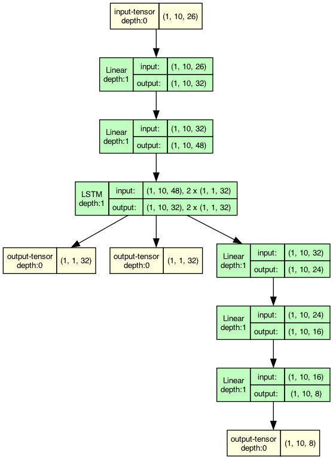

# Multi-Agent Systems Project

**Elective course project – Multi-Agent Systems @ CentraleSupélec**

## 👥 Authors
- Pierre JOURDIN  
- Aymeric CONTI

## 🧠 Project Overview

This project explores the design and implementation of **multi-agent systems** in a simulated environment for managing **radioactive waste** using various types of autonomous robots.

The project includes:
- 🌍 **Environment** definition  
- 🖼️ **Visualization tools** (interactive frontend with Solara)  
- 🤖 **Rule-based agent behaviors**  
  - Without communication  
  - With communication  
- 🧬 **Reinforcement Learning (RL) agents**  
- 📊 **Benchmarking & performance comparison**

## 🚀 Getting Started

Install dependencies:
```bash
pip install -r requirements.txt
```

To launch the interactive simulation:
```bash
solara run server.py
```
Use the sliders to change parameters and click "Reset" to restart the simulation with the new settings.

To replay a recorded session:
```bash
solara run replay.py
```

## 🗂️ Project Structure
File | Desccription
|---|---|
`action.py` | Implements agent actions: `apply()`, `can_apply()`
`agent.py` | Abstract base class for all agents
`benchmark.py` | Runs agents and benchmarks their speed/performance
`communication.py` | Defines communication protocols between agents
`information.py` | Manages information flow between agents
`knowledge.py` | Implements agent memory & perception history
`model.py` | Defines the Mesa simulation model
`network.py` | Neural network architectures used for RL agents
`objects.py` | Implements environment entities: `Waste`, `Radioactivity`, `Dump`, etc.
`perception.py` | Basic agent perception system
`record.py` | Record simulations to `.json` format
`replay.py` | Replays recorded simulations with Solara
`run.py` | Run simulations without GUI
`server.py` | Interactive server GUI with Solara
`train.py` | Train RL agents using Q-Mix
`utils.py` | Utility classes: `Color`, `Direction`, etc.

## 🌐 Environment Details

- Grid size: **10 x 10**, 30% green, 30% yellow, 40% red
- Agent vision: limited to the **four cardinal neighboring cells**, in addition to the current cell
- Constraints:
  - Only **one agent** per cell
  - Only **one waste** per cell
- Initial state:
  - **Agents**: 3 green, 2 yellow, 1 red
  - **Wastes**: 12 green, 6 yellow, 3 red
- **Dump location**: (9, 4) — center of the right border

## 🤖 Approaches Explored

### 1. 🔁 Baseline Agents
- **Random**: Chooses actions at random.
- **Naive**: Picks up or merges if possible, drops if it is already merged, moves to adjacent cases if there is something to pick up, moves randomly in last resort.

### 2. 🧾 Rule-Based Agents
- **Without Communication**: Agents act independently, using only local observations.
- **With Communication**: Agents share key information (e.g. waste positions or goals) to better coordinate.

### 3. 🧠 Reinforcement Learning (Q-Mix)

We implemented a **Q-Mix** architecture to enable cooperative behavior among agents under partial observability.

#### Agent Architecture
- Input: local perception and internal memory
- Core: **LSTM layer** for sequential input. The use of a LSTM allows strategies that takes multiple turns.
- Output: action-value estimates via **fully connected layers**



#### Mixing Network
- Combines agent Q-values conditioned on the global state
- Promotes **cooperative strategies** while preserving agent decentralization

#### Target Network
- Helps stabilize learning by providing consistent targets over time

#### Training Loop
1. Simulate an episode
2. Store transitions in a replay buffer
3. Sample mini-batches
4. Update both agent networks and the mixing network

#### Training Details
- Discount factor `γ = 0.9` gave the best results
- Total training time: **~4 hours**

## 📊 Results & Visualizations

We benchmarked all approaches in terms of:
- Task completion time
- Number of collected and delivered wastes
- Collaboration efficiency

> *(Insert benchmark performance graph here)*